# CodeGist System
## Solving "Context Loss" in Large-Scale Code Repositories

  
  

---
layout: center
class: text-center
---

# The Reality of AI Coding

> "Why does my Copilot fail when I ask about a bug buried deep in a million-line repo?"

The promise of Infinite Context vs. The Reality of Retrieval

---

# The Problem: Context Loss

Large Language Models (LLMs) suffer from the **"Lost-in-the-Middle"** effect.

* **Context Window Limit:** Even "large" windows cannot fit massive repositories.
* **Degradation:** Performance drops significantly when data is in the middle of the prompt \[1\].
* **Illusion:** Advertised context size $\neq$ Effective context size \[3\].

---
transition: fade-out
layout: section
---

# Why Current Methods Fail

Three dominant approaches, three critical flaws.

---
layout: two-cols
---

# Text Embeddings

Treating code like natural language.

<v-click>

### The Flaw: "Lexical" vs "Functional"
* Embeddings capture text similarity, not logic.
* Cannot distinguish a *function definition* from a *function call*.
* **Result:** Retrieves irrelevant code that "looks" similar.

</v-click>

::right::

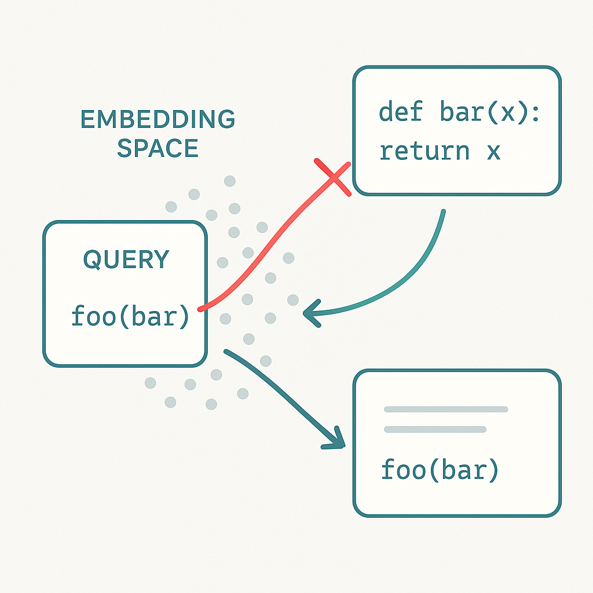

---
layout: two-cols
---

# AST Maps

Feeding the raw syntax tree to the LLM.

<v-click>

### The Flaw: Verbosity
* ASTs are massive (often 10x code size).
* A 1M line codebase = Billions of tokens.
* **Result:** Instantly overflows the context window.

</v-click>

::right::

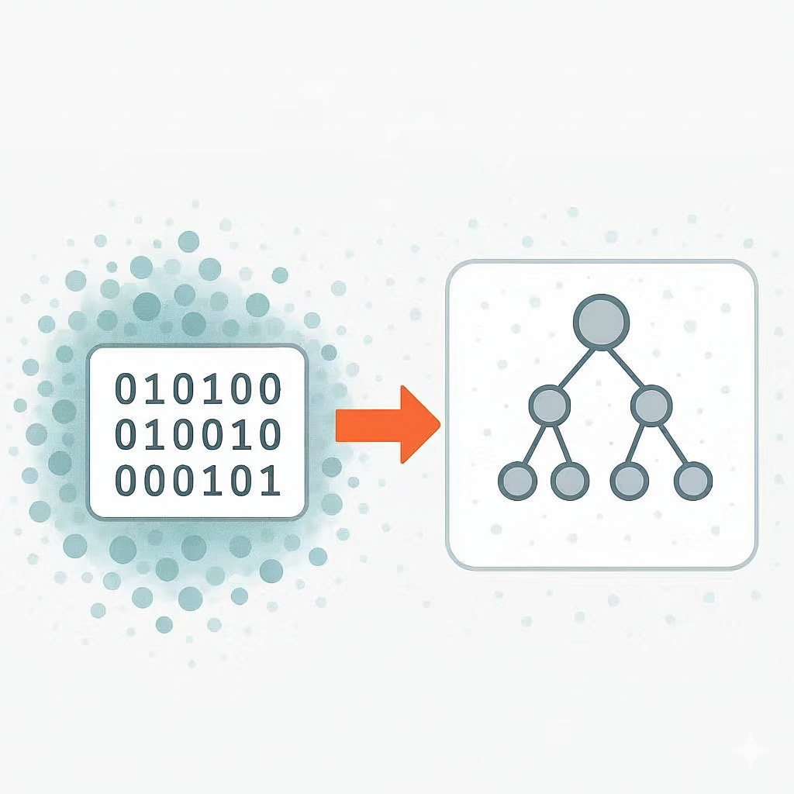

---
layout: two-cols
---

# Agentic RAG

<v-click>

### The Flaw
* Inefficiency
  * LLM explores codebase using tools like grep and ls.
  * Sequential keyword searches check files one by one.
* Result: Slow, brittle.

</v-click>

::right::

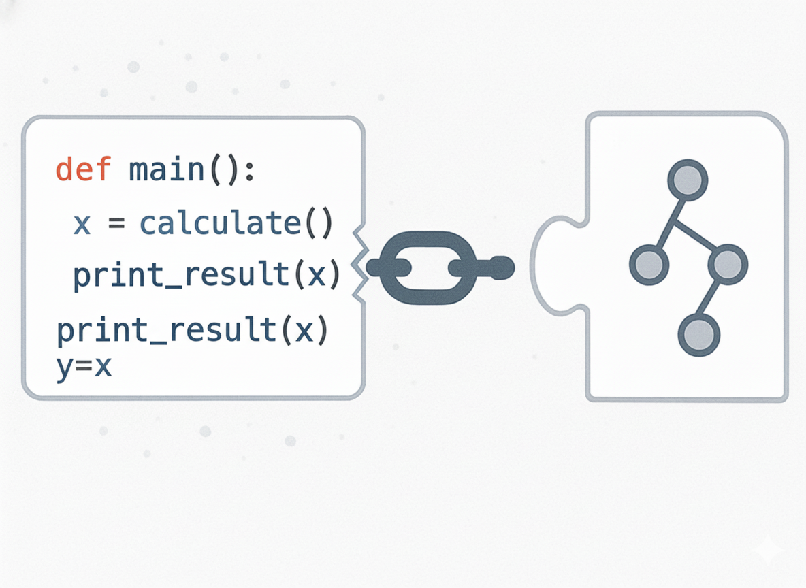

---
layout: center
class: text-center
---

# What We Need

To solve this, we need a paradigm shift.

    

        <carbon:meter class="text-3xl text-blue-500 mb-2"/>
        <h3 class="font-bold">Token Efficiency</h3>
        
Decouple retrieval cost from repo size.

    

    

        <carbon:ibm-watson-knowledge-studio class="text-3xl text-green-500 mb-2"/>
        <h3 class="font-bold">Structural Awareness</h3>
        
Understand call graphs, not just text matches.

    

    

        <carbon:chemistry class="text-3xl text-purple-500 mb-2"/>
        <h3 class="font-bold">Determinism</h3>
        
Zero hallucinations on dependencies.

    

---

# Boundary Conditions & Scalability

We are building for the real world, not just a demo.

  <ul class="space-y-2">
    <li><b>Target Scale:</b> < 1,000,000+ Lines of Code.</li>
    <li><b>Latency:</b> < 10 minutes.</li>
    <li><b>Complexity:</b> Multi-file tracing.</li>
  </ul>

  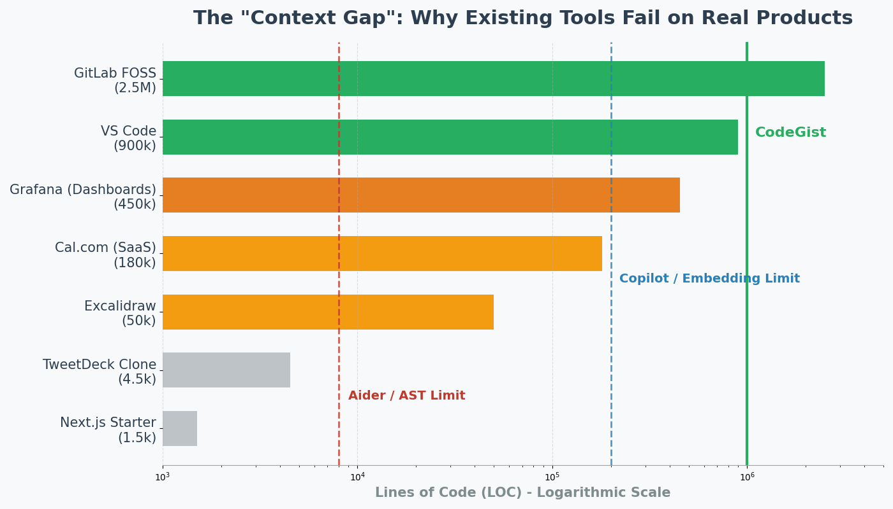

---
transition: slide-up
layout: section
---

# The Solution
**Structural Candidate Generation** $\to$ **Semantic Filtering**  $\to$  **Deterministic Context Expansion**

---

# The Technical Core

We leverage two industrial-grade engines to treat code as **Data**, not Text.

  <h2 class="text-green-600">ast-grep</h2>
  
"Structural Regex"

  <ul class="text-left mt-4 text-sm">
    <li>Pattern matching on AST nodes.</li>
    <li>Insane speed (Milliseconds).</li>
    <li>Filters noise (comments vs code).</li>
  </ul>

  <h2 class="text-blue-600">GitHub CodeQL</h2>
  
"Relational Database"

  <ul class="text-left mt-4 text-sm">
    <li>Treats code as a database.</li>
    <li>Deep analysis (Taint tracking, Data flow).</li>
    <li>Connects logic across files.</li>
  </ul>

---
transition: slide-up
layout: section
---

# The CodeGist System

---

# The Pipeline: Step 1
## Structural Candidate Generation(**First LLM Call**)

*   **Mechanism:** LLM generates *permissive* `ast-grep` patterns.
*   **Input:** "Find retry logic."
*   **Pattern:** `try { $$$ } catch ($$$) { $$$ retry $$$ }`

<!-- VISUALIZATION DESCRIPTION:
An animation of a funnel.
Top of funnel: "1 Million Lines of Code".
Action: A filter labeled "ast-grep" slides across.
Output: "200 Candidate Snippets".
-->

  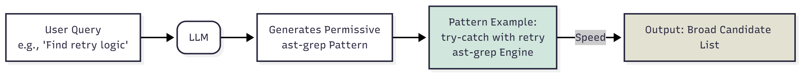

---

# The Pipeline: Step 2
## Semantic Relevance Filtering

*   **Mechanism:** Cross-Encoder Re-Ranker.
*   **Action:** Compare User Query $\leftrightarrow$ Candidate Snippets.
*   **Output:** Top-k most relevant one.
*   **Significance:** Bridges the gap between *Syntactic Structure* and *User Intent*.

<!-- VISUALIZATION DESCRIPTION:
A magnifying glass focusing on the "200 Candidates".
The glass highlights 5 specific blocks in bright green ("Anchors") and fades the rest to grey.
-->

  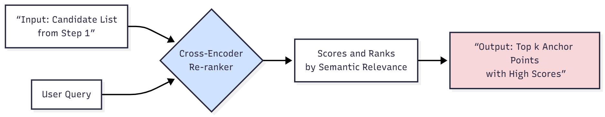

---

# The Pipeline: Step 3
## Deterministic Context Expansion(**Second LLM call**)

*   **Mechanism:** LLM generates a **CodeQL** query based on ast-grep results(anchor).
*   **Result:** A connected subgraph of executable logic. 

  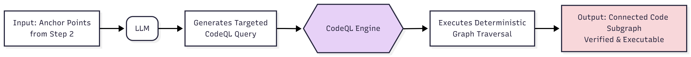

---

# The Gap: Limited Knowledge of CodeQL & ast-grep.

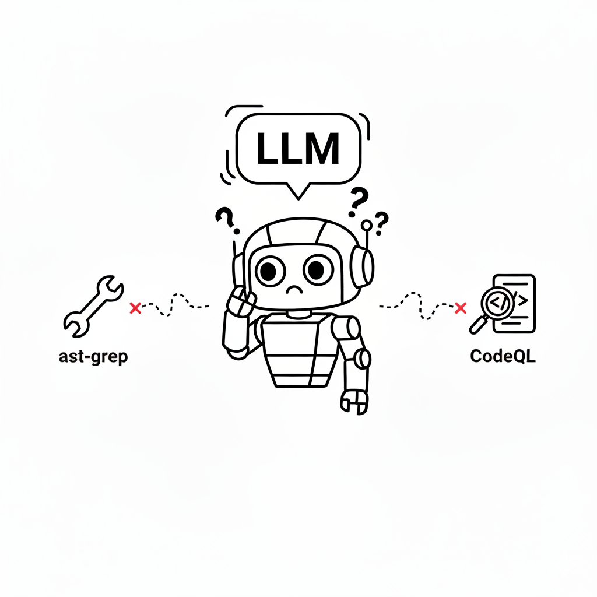

---
layout: center
class: text-center
---

# Enabling the Model

How we bridge the gap between general intelligence and specific tool mastery.
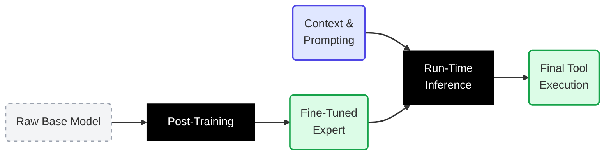

---

# Tool-Use Supervised Fine-Tuning

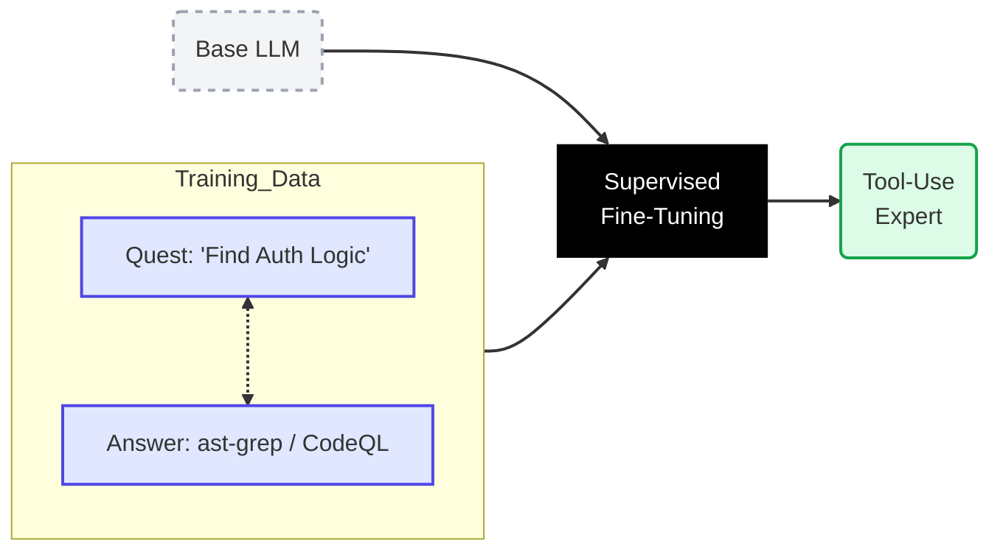

---

# Reinforcement Learning

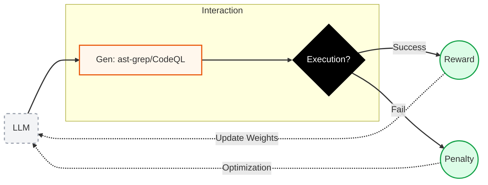

<!--

  

    <carbon:education class="text-3xl text-blue-500 mr-2" />
    <h3 class="text-xl font-bold">1. Tool-Use SFT</h3>
  

  

    <b>Supervised Fine-Tuning</b>
  

  

    The "Classroom" phase. We teach the model the <i>language</i> of the tools.
  

  <ul class="mt-2 text-sm list-disc pl-4 space-y-2">
    <li><b>Input:</b> "Find user authentication logic"</li>
    <li><b>Target:</b> Valid <code>ast-grep</code> patterns & <code>CodeQL</code> syntax.</li>
    <li><b>Goal:</b> Fluency in tool usage.</li>
  </ul>

  

    <carbon:trophy class="text-3xl text-yellow-500 mr-2" />
    <h3 class="text-xl font-bold">2. Reinforcement Learning</h3>
  

  

    <b>Reward-Based Optimization</b>
  

  

    The "Practice" phase. We optimize for <i>results</i>.
  

  <ul class="mt-2 text-sm list-disc pl-4 space-y-2">
    <li><b>Reward (+1):</b> If the query returns a verifiable, executable code path.</li>
    <li><b>Penalty (-1):</b> If the query is syntactically correct but returns nothing.</li>
  </ul>

-->

---
layout: two-cols
---

# Run-time Context
* Provide unified documentation for `ast-grep` and `CodeQL`.  
* Inject system prompt:  

::right::

System: You are a Structural Analysis Agent.

Tool:
- ast-grep
- CodeQL

Task:
1. Consult docs.
2. Decompose user query.
3. Construct into deterministic query.

---

# Verification: Why This Wins

<h3 class="text-blue-500">Token Efficiency</h3>

We don't scan code. We generate queries.

LLM only sees the final result, not the whole repo.

<h3 class="text-green-500">Structure Aware</h3>

We take advantage of the AST.

We see calling stack and function chain.

<h3 class="text-purple-500">Zero Hallucination</h3>

Deterministic Retrieval.

Dependencies are proven by ast-grep/CodeQL, not predicted.

---
layout: center
class: text-center
---

# Conclusion

Shifting the heavy lifting of search from the LLM to ast-grep/CodeQL

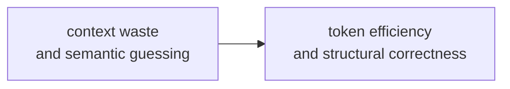

  <h2 class="text-xl font-bold">Please Invest in CodeGist system.</h2>

